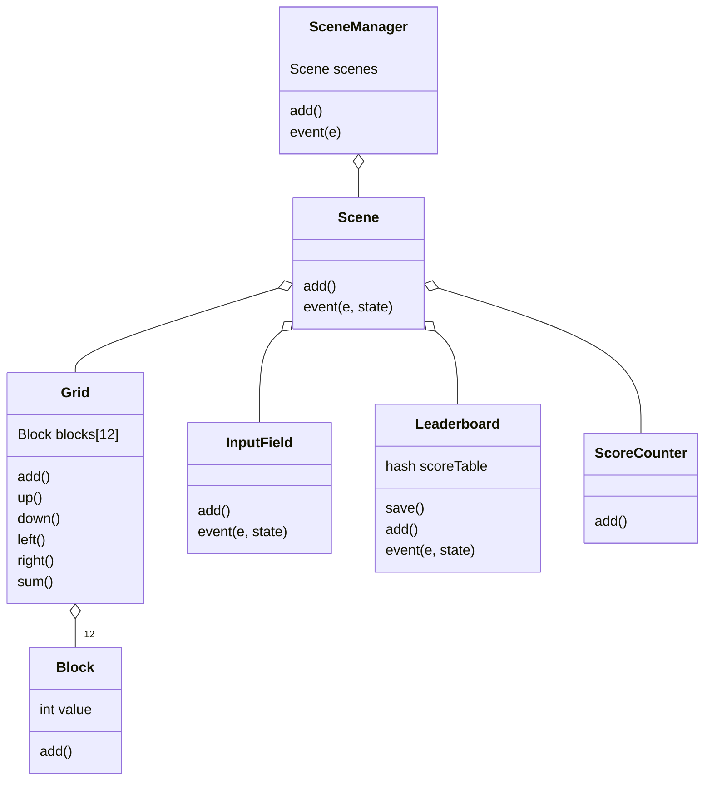

# 2048 in Ruby
A simple implementation of the famous game '2048' in Ruby using the [ruby2d](https://www.ruby2d.com/) library.

# Running
simply run main.rb with:
```
ruby main.rb
```

## Class diagram



## Table of Contents
 - [SceneManager](#scenemanager)
 - [Scene](#scene)
 - [InputField](#inputfield)
 - [Grid](#grid)
 - [Block](#block)
 - [ScoreCounter](scorecounter)
 - [Leaderboard](leaderboard)

# SceneManager
This class is responsible for switching between multiple Scenes

#### Args:
  - scenes[] => array of Scenes that will be accesible to SceneManager

#### Methods:
  - add() => used to draw the currently selected Scene
  - event(e) => used to execute the event(e, state) function of the current Scene with the argument state, an array containing the index of the current Scene

# Scene
This class is responsible for containing elements that make up the diffrent scenes

#### Args:
  - items[] => array of items that will be displayed

#### Methods:
  - add() => used to draw the elements
  - event(e, state) => used to execute the event(e, state) function of the elements

# InputField
This class creates a text input field that can receive keyboard input and return a state.

#### Args:
  - text => the string that will be modified by the user
  - x => x coordinate of the text field
  - y => y coordinate of the text field
  - size => size of the font

#### Methods:
  - add() => used to draw the text
  - event(e, state) => reads user input and increases the state when the user pressed ENTER

# Grid
This class draws the grid of blocks

#### Args:
  - window => Window of the game, used to calculate position


#### Methods:
  - add() => used to draw the blocks
  - event(e, state) => used to read the input and control the blocks
  - sum() => sums the values of the blocks
  - up() => shifts and adds the blocks up
  - down() => shifts and adds the blocks down
  - left() => shifts and adds the blocks left
  - right() => shifts and adds the blocks right
  - randomize() => adds a block to a random empty place
  - check(state) => increases state if the grid is full

# Block
This class draws the block

#### Args:
  - val => starting value of the block
  - x => x coordinate of the block
  - y => y coordinate of the block
  - size => size of the font

#### Methods:
  - add() => used to draw the block
  - getters and setters for val, x, y, size


# ScoreCounter
This class draws the current score

#### Args:
  - grid => Grid from which the score will be calculated
  - playerScore => array of the player name and score
  - x => x coordinate of the text
  - y => y coordinate of the text
  - size => size of the font

#### Methods:
  - add() => used to draw the text
 
# Leaderboard
This class draws a table of the 8 highest scores of previous players and saves it to a file

#### Args:
  - playerScore => array of the player name and score
  - x => x coordinate of the Leaderboard
  - y => y coordinate of the Leaderboard
  - size => size of the font

#### Methods:
  - save() => saves the score hash to a file
  - add() => used to draw the text
  - event(e, state) => reads user input and increases the state when the user pressed ENTER
